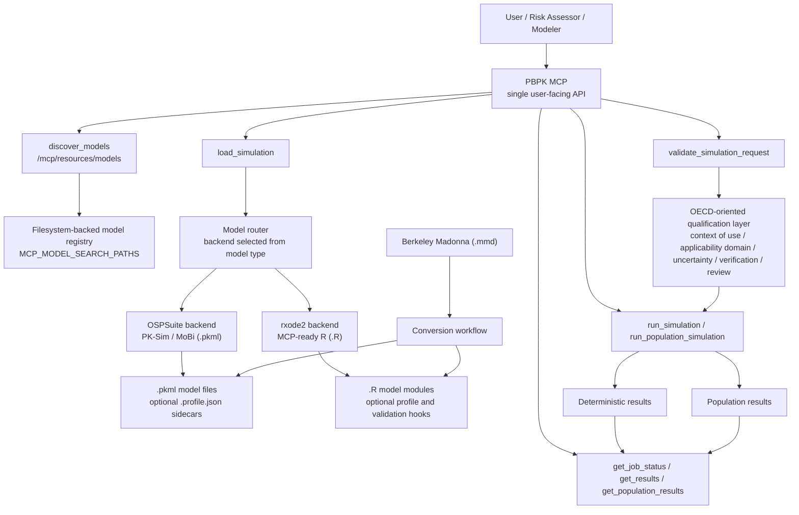

# PBPK MCP Server

Part of [ToxMCP Suite](https://github.com/ToxMCP/toxmcp)

Public MCP server for physiologically based pharmacokinetic (PBPK) modeling with Open Systems Pharmacology Suite and `rxode2`.
Expose model discovery, deterministic and population simulations, parameter edits, PK analytics, and OECD-oriented qualification metadata to any MCP-aware agent such as Codex CLI, Gemini CLI, Claude Code, or custom MCP clients.

## Why this project exists

PBPK workflows usually juggle PK-Sim and MoBi transfer files, exported projects, native R models, OSPSuite tooling, and ad-hoc scripts that are hard for coding agents to automate safely.

PBPK MCP wraps those workflows in a programmable interface with explicit guardrails:

- Single MCP surface for discovering models, loading them, editing parameters, running simulations, and retrieving results.
- Dual execution engines behind one interface: `ospsuite` for `.pkml` and `rxode2` for MCP-ready `.R`.
- Async job orchestration with cancellation, persistent state, and idempotent reruns.
- OECD-oriented preflight checks that distinguish runtime support from scientific qualification.
- Agent-friendly HTTP and JSON-RPC endpoints that expose schemas, annotations, and stable payloads.

## Feature snapshot

| Capability | Description |
| --- | --- |
| 🧬 PBPK simulation control | Load `.pkml` and MCP-ready `.R` models, list or edit parameters, and run deterministic or population simulations through MCP tools. |
| 🔎 Model discovery | Discover supported models on disk through `discover_models` and `/mcp/resources/models` before loading them. |
| ⚙️ Dual execution engines | Use `ospsuite` for PK-Sim and MoBi transfer files and `rxode2` for native R-authored PBPK models. |
| 🧾 PK analytics | Compute Cmax, Tmax, and AUC on completed runs and retrieve aggregated population outputs. |
| 🔁 Job orchestration and idempotency | Queue deterministic or population runs, poll status, cancel work, and deduplicate reruns with `idempotencyKey`. |
| 🛡️ Guardrails by default | Critical tools require confirmation, and `validate_simulation_request` returns applicability, readiness, and `oecdChecklist` metadata. |
| 📈 Audit and observability | `/health`, `/metrics`, audit-trail support, and regression smoke suites are built into the repo. |
| 🤖 Agent friendly | Exposes `/mcp`, `/mcp/list_tools`, `/mcp/call_tool`, and enriched `pbpk-mcp.v1` payloads for client chaining. |

## Table of contents

- [Quick start](#quick-start-docker)
- [Verification](#verification-smoke-test)
- [Real-world examples](#real-world-examples)
- [Supported model types and limitations](#supported-model-types-and-limitations)
- [Architecture](#architecture)
- [Configuration](#configuration)
- [Tool catalog](#tool-catalog)
- [Running the server](#running-the-server)
- [Integrating with coding agents](#integrating-with-coding-agents)
- [Output artifacts](#output-artifacts)
- [Security checklist](#security-checklist)
- [Development notes](#development-notes)
- [Roadmap](#roadmap)
- [Citation](#citation)
- [License](#license)

## Quick start (Docker)

The easiest way to run the server with the real OSPSuite and `rxode2` engines is through the included Docker deployment.

```bash
git clone https://github.com/ToxMCP/pbpk-mcp.git
cd pbpk-mcp

mkdir -p var/jobs var/population-results
cp .env.example .env

./scripts/build_rxode2_worker_image.sh
./scripts/deploy_rxode2_stack.sh
```

The local development stack exposes:

- API endpoint: `http://localhost:8000/mcp`
- Health endpoint: `http://localhost:8000/health`
- Convenience endpoints: `/mcp/list_tools`, `/mcp/call_tool`, `/mcp/resources/models`
- Worker: Celery-backed execution on `pbpk_mcp-worker-rxode2:latest`
- Models: place `.pkml` and MCP-ready `.R` files under `var/models` or another path in `MCP_MODEL_SEARCH_PATHS`

Important local-dev note:

- `docker-compose.celery.yml` currently enables `AUTH_ALLOW_ANONYMOUS=true` for local testing convenience
- do not keep that setting for production exposure

## Verification (smoke test)

Once the server is running:

```bash
curl -s http://127.0.0.1:8000/health | jq .
curl -s http://127.0.0.1:8000/mcp/list_tools | jq '.tools | length'
curl -s 'http://127.0.0.1:8000/mcp/resources/models?search=cisplatin&limit=10' | jq .

PBPK_MCP_ENDPOINT=http://127.0.0.1:8000/mcp ./scripts/mcp_http_smoke.sh
```

## Real-world examples

We provide a mix of workflow scripts and curated model assets demonstrating full workflows against the real engines:

- Native `rxode2` cisplatin population model
  - [`var/models/rxode2/cisplatin/cisplatin_population_rxode2_model.R`](var/models/rxode2/cisplatin/cisplatin_population_rxode2_model.R)
  - demonstrates direct R-authored PBPK execution, population simulation, and OECD-style validation
- Pregnancy PK-Sim example with sidecar profile
  - [`var/models/esqlabs/pregnancy-neonates-batch-run/Pregnant_simulation_PKSim.pkml`](var/models/esqlabs/pregnancy-neonates-batch-run/Pregnant_simulation_PKSim.pkml)
  - demonstrates OSPSuite runtime plus declared scientific profile sidecar metadata
- Cross-species PK-Sim example
  - [`var/models/esqlabs/PBPK-for-cross-species-extrapolation/Sim_Compound_PCPKSimStandard_CPPKSimStandard_Rat.pkml`](var/models/esqlabs/PBPK-for-cross-species-extrapolation/Sim_Compound_PCPKSimStandard_CPPKSimStandard_Rat.pkml)
  - demonstrates runtime output fallback for transfer files with empty output selections
- Example workflows in [`examples/`](examples/)
  - brain barrier distribution
  - manual liver-volume sensitivity
  - virtual population variability
  - parameter exploration
  - async job control
  - sensitivity-tool demo
  - chlorpyrifos risk-assessment example
- Curated smoke runner
  - `python3 scripts/esqlabs_models.py smoke-run`

See [`examples/README.md`](examples/README.md) for details.

## Supported model types and limitations

### Runtime support

| Format | Status | Engine / path | Notes |
| --- | --- | --- | --- |
| `.pkml` | Direct runtime support | `ospsuite` | Primary runtime format for PK-Sim and MoBi transfer files. |
| `.R` | Direct runtime support | `rxode2` | Native R-authored PBPK models are supported when they implement the PBPK R model contract. |
| `.pksim5` | Conversion workflow | Export to `.pkml` | Use [`scripts/convert_pksim_to_pkml.R`](scripts/convert_pksim_to_pkml.R) before loading. |
| `.mmd` | Conversion workflow | Convert to `.R` or `.pkml` | Berkeley Madonna files are source artifacts, not direct runtime inputs. |

### Conversion

Example `.pksim5` conversion:

```bash
Rscript scripts/convert_pksim_to_pkml.R path/to/project.pksim5 output/directory
```

### Important limitations

- The MCP runtime does not directly execute `.pksim5`.
- The MCP runtime does not directly execute Berkeley Madonna `.mmd`.
- `rxode2` is a first-class runtime engine, not only a conversion destination.
- Population simulation is currently implemented through the `rxode2` path.
- Runtime support does not imply regulatory qualification.
- Many included scientific profiles are intentionally marked `illustrative-example` or `research-use`, not regulatory-ready.

## Architecture



This diagram is intentionally product-level rather than infrastructure-level:

- users see one PBPK MCP surface
- backend selection is explicit but automatic
- `rxode2` is a first-class engine, not only a conversion target
- OECD-style qualification sits beside execution, not hidden inside it
- Berkeley Madonna remains a conversion workflow, not a third runtime backend

## Configuration

Settings are loaded from `.env` and the application config model in [`src/mcp_bridge/config.py`](src/mcp_bridge/config.py).
Common knobs:

| Variable | Source default | Docker compose | Description |
| --- | --- | --- | --- |
| `HOST` | `0.0.0.0` | `0.0.0.0` | Bind address for the FastAPI app. |
| `PORT` | `8000` | `8000` | HTTP port. |
| `ADAPTER_BACKEND` | `inmemory` | `subprocess` | Adapter backend: use `inmemory` for fast local tests, `subprocess` for real R and OSPSuite execution. |
| `MCP_MODEL_SEARCH_PATHS` | `tests/fixtures` in `.env.example` | `/app/var` | Colon-separated model discovery roots. |
| `JOB_BACKEND` | `thread` | `celery` | Async job backend: `thread`, `celery`, or `hpc`. |
| `JOB_REGISTRY_PATH` | `var/jobs/registry.json` | `/app/var/jobs/registry.json` | Persistent job registry path. |
| `AUTH_ALLOW_ANONYMOUS` | `false` | `true` in local compose | Development-only anonymous access switch. |
| `AUDIT_ENABLED` | `true` | enabled in local compose | Toggle immutable audit-trail recording. |

Also see:

- [`.env.example`](.env.example)
- [`docker-compose.celery.yml`](docker-compose.celery.yml)
- [`src/mcp_bridge/config.py`](src/mcp_bridge/config.py)

## Tool catalog

| Tool | Description | Notes |
| --- | --- | --- |
| `discover_models` | Discover supported PBPK model files under `MCP_MODEL_SEARCH_PATHS`. | Includes unloaded workspace models. |
| `load_simulation` | Load a `.pkml` or MCP-ready `.R` model into the active session registry. | Critical; requires confirmation. |
| `validate_simulation_request` | Run OECD-style applicability and guardrail assessment for a loaded model. | Use before risk-assessment or cross-domain runs. |
| `list_parameters` | List parameter paths available in a loaded simulation. | Supports glob-style filtering. |
| `get_parameter_value` | Retrieve the current value of a simulation parameter. | Read-only. |
| `set_parameter_value` | Update a simulation parameter. | Critical; requires confirmation. |
| `run_simulation` | Submit an asynchronous deterministic simulation. | Supports `idempotencyKey`; critical. |
| `get_job_status` | Inspect a submitted job. | Returns flattened top-level status plus compatibility payloads. |
| `get_results` | Retrieve stored deterministic simulation results. | Works with async deterministic jobs. |
| `calculate_pk_parameters` | Compute Cmax, Tmax, and AUC from stored results. | Works on completed deterministic results. |
| `run_population_simulation` | Submit an asynchronous cohort simulation. | `rxode2` path; supports `idempotencyKey`; critical. |
| `get_population_results` | Fetch aggregated population outputs and chunk handles. | For completed population runs. |
| `cancel_job` | Request cancellation of a queued or running job. | Async job control. |
| `run_sensitivity_analysis` | Execute a multi-parameter sensitivity workflow. | Critical; requires confirmation. |

Each tool in `list_tools` exposes JSON Schemas plus annotations such as `critical`, `requiresConfirmation`, and role hints.

## Running the server

### Local development (Python only)

Fast local development with the in-memory adapter:

```bash
python3 -m venv .venv
source .venv/bin/activate
pip install -e '.[dev]'

export AUTH_DEV_SECRET=dev-secret
export ADAPTER_BACKEND=inmemory
export MCP_MODEL_SEARCH_PATHS="$(pwd)/tests/fixtures:$(pwd)/var"

uvicorn mcp_bridge.app:create_app --factory --host 0.0.0.0 --port 8000 --reload
```

### Real engine local development

Local development with the real R and OSPSuite path:

```bash
export AUTH_DEV_SECRET=dev-secret
export ADAPTER_BACKEND=subprocess
export MCP_MODEL_SEARCH_PATHS="$(pwd)/var"

uvicorn mcp_bridge.app:create_app --factory --host 0.0.0.0 --port 8000 --reload
```

When using `subprocess`, the host environment must have the required R, OSPSuite, and `rxode2` dependencies available.

### Quick MCP smoke test

Convenience HTTP:

```bash
curl -s http://127.0.0.1:8000/mcp/list_tools | jq '.tools | length'

curl -s -X POST http://127.0.0.1:8000/mcp/call_tool \
  -H "Content-Type: application/json" \
  -d '{"tool":"discover_models","arguments":{"search":"cisplatin","limit":5}}' | jq .
```

JSON-RPC over `/mcp`:

```bash
PBPK_MCP_ENDPOINT=http://127.0.0.1:8000/mcp ./scripts/mcp_http_smoke.sh
```

## Integrating with coding agents

- Add `http://localhost:8000/mcp` as an MCP provider in your client.
- Use `/mcp/list_tools` and `/mcp/call_tool` if your client prefers convenience endpoints over raw JSON-RPC.
- Include `critical: true` when calling critical tools through the convenience endpoint.
- Handle confirmation-required responses for critical actions.
- Provide `idempotencyKey` on `run_simulation` and `run_population_simulation` when safe reruns matter.
- Call `validate_simulation_request` before using a model for risk-assessment or cross-domain claims.

## Output artifacts

- Structured MCP payloads
  - enhanced tools return `tool`, `contractVersion`, and `structuredContent`
- Model discovery resources
  - `/mcp/resources/models` separates discoverable files from loaded sessions
- Deterministic and population result storage
  - job metadata under `var/jobs`
  - population payloads under `var/population-results`
- Audit trail
  - immutable local audit storage under `var/audit` when enabled
- Metrics
  - Prometheus-compatible telemetry at `/metrics`

## Security checklist

- Disable anonymous access in production.
  Set `AUTH_ALLOW_ANONYMOUS=true` only for local development.
- Require auth for deployed environments.
  Configure JWT validation with `AUTH_ISSUER_URL`, `AUTH_AUDIENCE`, and related settings, or enforce auth at the gateway.
- Use confirmation for critical mutations.
  Critical tools are explicitly annotated and require confirmation.
- Use idempotency keys for reruns.
  Deterministic and population submissions support `idempotencyKey`.
- Limit model search roots.
  Keep `MCP_MODEL_SEARCH_PATHS` restricted to trusted model directories.
- Respect qualification boundaries.
  Runtime support is not the same thing as scientific qualification.
- Keep heavy workers bounded.
  The local Celery worker is intentionally capped at `4 GiB`.

## Development notes

- Quality gates
  - `make lint`
  - `make type`
  - `make test`
- Heavier validation
  - `make benchmark`
  - `make parity`
  - `python3 -m unittest -v tests/test_oecd_live_stack.py`
  - `python3 -m unittest -v tests/test_model_discovery_live_stack.py`
- Image and stack helpers
  - [`scripts/build_rxode2_worker_image.sh`](scripts/build_rxode2_worker_image.sh)
  - [`scripts/deploy_rxode2_stack.sh`](scripts/deploy_rxode2_stack.sh)
  - [`scripts/apply_rxode2_patch.py`](scripts/apply_rxode2_patch.py)
- Curated model utilities
  - `python3 scripts/esqlabs_models.py write-index`
  - `python3 scripts/esqlabs_models.py prepare-live-server`
  - `python3 scripts/esqlabs_models.py smoke-run`

## Roadmap

- Expand model-level OECD qualification packages, uncertainty dossiers, and sidecars.
- Add more native `rxode2` reference models and population examples.
- Automate safer provenance-preserving `.pksim5` and `.mmd` conversion workflows.
- Broaden parity and benchmark coverage across curated PBPK examples.
- Improve runtime and deployment documentation for dual-backend production use.

## Citation

If you use ToxMCP or PBPK MCP in your work, please cite the BioRxiv preprint referenced in [`CITATION.cff`](CITATION.cff):

- Djidrovski, I. *ToxMCP: Guardrailed, Auditable Agentic Workflows for Computational Toxicology via the Model Context Protocol*.
- DOI: [10.64898/2026.02.06.703989](https://doi.org/10.64898/2026.02.06.703989)

## License

This project is distributed under the Apache License 2.0.

See [`LICENSE`](LICENSE).
