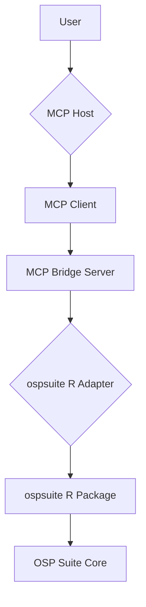

# MCP Bridge Architecture

## 1. Runtime and R Interop Strategy

### 1.1. Decision Matrix

The following matrix evaluates the different strategies for the MCP Bridge runtime and R interoperability.

| Strategy | Description | Pros | Cons | Prerequisites | Fallback |
| :--- | :--- | :--- | :--- | :--- | :--- |
| **Node.js + `Rscript` subprocess** | The MCP server is a Node.js application that executes R scripts using the `Rscript` command-line tool. | - Language separation is clean. - Easy to implement. - Minimal dependencies. | - Performance overhead from starting a new R process for each call. - Error handling can be complex. - Data serialization via stdin/stdout can be inefficient. | - Node.js installed. - R installed and in the system's PATH. | Python + `rpy2` | 
| **Python + `rpy2`** | The MCP server is a Python application that uses the `rpy2` library to interact with R in the same process. | - High performance due to in-process communication. - Rich error handling capabilities. - Mature and well-documented library. | - Tighter coupling between Python and R. - Potential for memory leaks if not managed carefully. - Requires careful management of the R environment. | - Python installed. - R installed. - `rpy2` library installed. | Node.js + `Rscript` | 
| **R `plumber` microservice** | The MCP server is a microservice written in R using the `plumber` package, which exposes R functions as a REST API. | - Native R implementation. - Easy to expose R functions as API endpoints. - Good performance. | - Requires a separate process for the `plumber` service. - Adds another moving part to the architecture. - May require more complex deployment and management. | - R installed. - `plumber` package installed. | Python + `rpy2` | 

### 1.2. Selected Approach and Rationale

**Selected Approach:** Python + `rpy2`

**Rationale:**

The Python + `rpy2` approach is selected as the primary implementation strategy for the following reasons:

- **Performance:** In-process communication between Python and R offers the best performance, which is critical for a responsive user experience.
- **Robustness:** `rpy2` provides a mature and well-tested bridge between Python and R, with excellent error handling and data conversion capabilities.
- **Ecosystem:** Python has a rich ecosystem of libraries for building web services (e.g., FastAPI, Flask) and interacting with other systems, which will be beneficial for the MCP server's development.

While this approach introduces a tighter coupling between Python and R, the benefits in terms of performance and robustness outweigh this drawback. The development team will need to pay close attention to memory management and the R environment to ensure a stable and reliable system.

## 2. Server Architecture

### 2.1. Component Diagram

### 2.2. Deployment Topology

The MCP Bridge Server will be deployed as a containerized application. The OSP Suite and R environment will be installed in the same container to ensure a consistent and reproducible environment.

### 2.3. Async Job Workflow

1. The user initiates a long-running job (e.g., a simulation) via the MCP Host.
2. The MCP Bridge Server receives the request and creates a new job in a persistent job queue (e.g., Redis).
3. The server immediately returns a `job_id` to the user.
4. A separate worker process picks up the job from the queue and executes it.
5. The user can poll the status of the job using the `get_job_status` tool, or request termination with the `cancel_job` tool if the run is no longer required.
6. Once the job is complete (or cancelled), the worker process stores the results in a persistent storage (e.g., a file system or a database) and updates the job status to a terminal state.
7. The user can retrieve the results using the `get_simulation_results` tool for successful runs. Cancelled jobs expose their last-known metadata for audit purposes but omit result handles.

### 2.3.1. Simulation Session Registry

To track which simulations are currently loaded, the MCP runtime now provides a lightweight, in-memory session registry (`mcp.session_registry`). The registry:

- Persists a `SimulationHandle` and associated metadata for each active `simulation_id`.
- Exposes thread-safe CRUD operations with duplicate detection and access timestamps.
- Supplies the foundation for MCP tools (starting with `load_simulation`) to coordinate adapter state outside of the HTTP surface.

Future tasks will integrate additional lifecycle hooks (eviction, persistence) as asynchronous job support lands.

### 2.4. Configuration Management

All configuration for the MCP Bridge Server will be managed via environment variables. A `.env.example` file will be provided to document all available configuration options.

Key variables for simulation tooling:

- `MCP_MODEL_SEARCH_PATHS`: colon-separated directories that define where `.pkml`
  files may be loaded from. Requests outside these roots are rejected before
  reaching the adapter.

### 2.5. Logging and Observability

- **Logging:** All log messages will be written in a structured JSON format to stdout.
- **Observability:** The server will expose a `/health` endpoint for health checks and a `/metrics` endpoint for Prometheus metrics.

## 3. Interface Contracts and Error Model

- The canonical REST contract is stored in `docs/mcp-bridge/contracts/openapi.json` with schemas for every tool interaction.
- Sequence-level interactions (happy path and failure branches) live in `docs/mcp-bridge/contracts/sequencediagrams.md`.
- Error handling across the bridge adheres to `docs/mcp-bridge/contracts/error-taxonomy.md`, ensuring stable codes, correlation ID propagation, and logging conventions.
