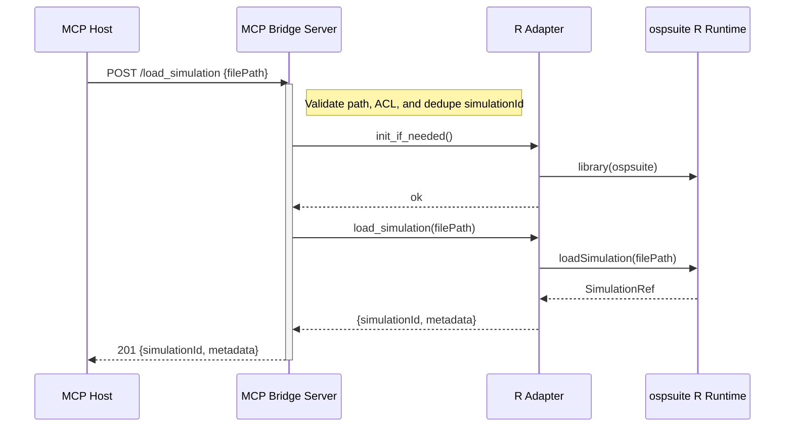
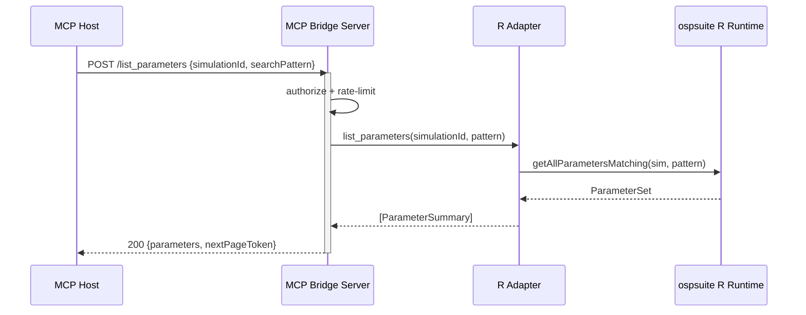
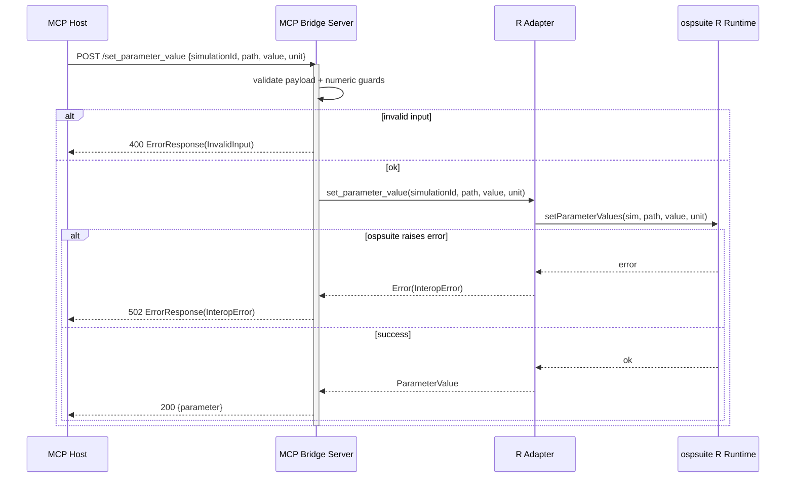

# Sequence Diagrams

The following sequence diagrams describe how the MCP Bridge communicates with the host agent and the ospsuite-backed R adapter. Each interaction propagates the `X-Correlation-Id` header so logs can be stitched together across the boundary.

## Load Simulation



## List Parameters



## Parameter Update With Validation



## Async Simulation Run and Result Retrieval

```mermaid
sequenceDiagram
    actor Scientist as User
    participant Client as MCP Host
    participant Bridge as MCP Bridge Server
    participant Queue as Job Queue
    participant Worker as Simulation Worker
    participant Adapter as R Adapter
    participant R as ospsuite R Runtime

    Scientist->>Client: Run simulation
    Client->>Bridge: POST /run_simulation {simulationId, runId}
    activate Bridge
    Bridge->>Queue: enqueue(jobDescriptor)
    Queue-->>Bridge: jobId
    Bridge-->>Client: 202 {jobId, queuedAt}
    deactivate Bridge
    loop Poll status
        Client->>Bridge: POST /get_job_status {jobId}
        Bridge->>Queue: get_status(jobId)
        Queue-->>Bridge: status=running
        Bridge-->>Client: 200 {status:\"running\"}
        alt cancellation requested
            Client->>Bridge: POST /cancel_job {jobId}
            Bridge->>Queue: cancel(jobId)
            Queue-->>Bridge: status=cancelled
            Bridge-->>Client: 200 {status:\"cancelled\", cancelledAt}
            break
        end
    end
    opt cancelled before execution
        Note over Queue,Worker: Worker does not receive the job; queue records terminal state.
    end
    Queue->>Worker: dispatch(jobId)
    Worker->>Adapter: run_simulation(simulationId, config)
    Adapter->>R: runSimulations(sim, config)
    R-->>Adapter: resultsHandle
    Adapter-->>Worker: {resultsId}
    Worker->>Queue: mark_succeeded(jobId, resultsId)
    Client->>Bridge: POST /get_job_status {jobId}
    Bridge->>Queue: get_status(jobId)
    Queue-->>Bridge: status=succeeded, resultsId
    Bridge-->>Client: 200 {status:\"succeeded\", resultHandle}
    Client->>Bridge: POST /get_simulation_results {resultsId}
    Bridge->>Adapter: get_results(resultsId)
    Adapter->>R: getOutputValues(resultsId)
    R-->>Adapter: ResultSet
    Adapter-->>Bridge: normalized JSON
    Bridge-->>Client: 200 {series}
```
